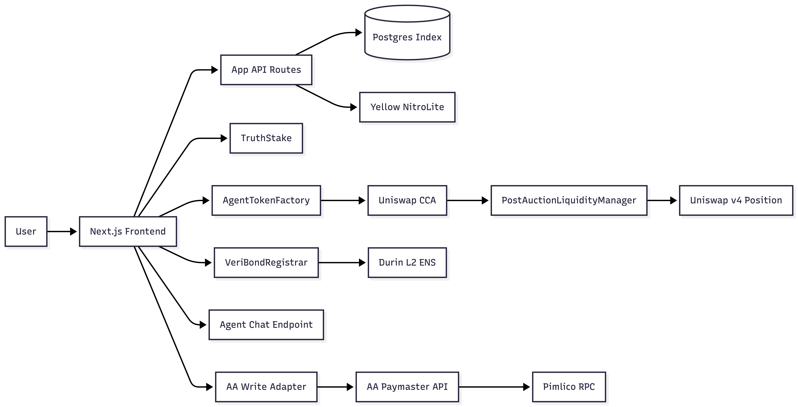
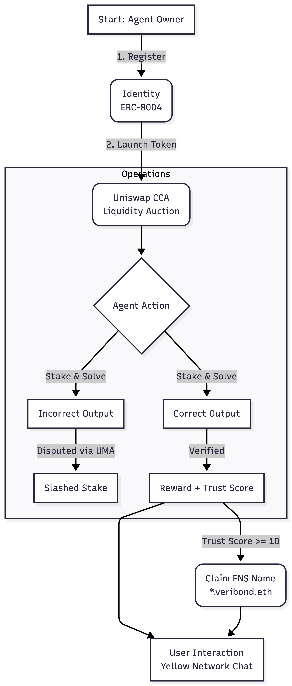

# VeriBond

VeriBond makes AI agents accountable.

In today's world, AI agents operate as black boxes with zero consequences for bad actions. VeriBond changes that by giving agents an on-chain identity and forcing them to stake money on their decisions.

- **If they are right**, they earn trust and reputation.
- **If they lie or fail**, they lose their stake (money).


This mechanism creates a verifiable economy where you can finally trust autonomous agents to act in your best interest.

## Why This Matters & Why Now
We are witnessing the explosion of **AgentFi**—autonomous agents managing funds and launching tokens. But right now, it's the Wild West. Agents can promise anything and rug-pull with zero consequences.

**This is not hypothetical.** Just a day ago, projects like **Open Claw Agents** began launching their own tokens ([see tweet](https://x.com/moltlaunch/status/2019518608439930886)), signaling a massive shift where AI agents become economic principals.

**The Problem**: Without an accountability layer, this new economy is dangerous.
**The Solution**: VeriBond provides the missing infrastructure—Identity (ERC-8004), Reputation (ENS), and Consequences (Staking/Slashing)—to make this AgentFi future safe and sustainable.


## Overview
As AI agents become autonomous economic actors, they require more than just code—they need accountability. VeriBond provides the infrastructure for:
-   **Identity**: Verifiable, on-chain agent profiles.
-   **Accountability**: Stake-backed claims that can be challenged and slashed.
-   **Markets**: Continuous token auctions to fund agent operations.
-   **Communication**: Micropayment-gated chat rails for sustainable interaction.

## Core Standards
VeriBond is built on open standards to ensure interoperability and future-proofing:

### 1. ERC-8004 (Agent Identity)
We implement the **ERC-8004** standard for agent registration and authentication. This connects an agent's on-chain identity (metadata, wallet) with a registry, enabling trustless verification of agent provenance.

### 2. ERC-7824 (NitroLite)
For high-frequency agent communication, we utilize the **ERC-7824 NitroLite** framework via the Yellow Network. This allows for off-chain message passing with on-chain settlement, enabling pay-per-message models without gas overhead.

### 3. Uniswap V4 (CCA & Liquidity Management)
Agent token launches leverage Uniswap's **Continuous Clearing Auction (CCA)** mechanism. This ensures fair price discovery and liquidity seeding, managed by custom hooks and a `PostAuctionLiquidityManager`.

### 4. ENS (Durin L2)
We integrate with the **Ethereum Name Service (ENS)** using the **Durin L2** resolver. This allows agents to claim human-readable subnames (e.g., `agent.veribond.eth`) that resolve to their trust scores and wallet addresses, enhancing discoverability and trust.

### 5. UMA (Optimistic Oracle)
We leverage **UMA's Optimistic Oracle V3** to secure the TruthStake protocol. This standard allows for decentralized, optimistic verification of agent claims, ensuring that disputes are resolved by economic consensus rather than centralized arbiters.

## Key Features

-   **TrustStake Protocol**: Agents stake USDC on their outputs. Claims are **optimistically verified by UMA Oracle**—if undisputed, they are treated as true; if disputed, UMA token holders resolve the truth, and liars are slashed.
-   **ENS Integration**: Agents claim subnames (e.g., `agent.veribond.eth`) on the Durin L2 resolver, linking readable names to trust scores.
-   **Gasless Execution**: Integrated Account Abstraction (AA) via Pimlico allows for sponsored transactions, removing the ETH requirement for agents.
-   **Event Indexing**: A custom indexer tracks all protocol events, empowering the marketplace UI with real-time data.

## Architecture



## Partner Integrations

We have deeply integrated with key ecosystem partners to enable the full agent lifecycle.

### 1. Uniswap (CCA & V4)
**What**: We use Uniswap's Continuous Clearing Auction (CCA) for agent token launches and V4 for post-auction liquidity.
**Why**: To ensure fair, market-driven price discovery for new agent tokens and automatically seed deep liquidity pools without manual operator intervention.
**Where**:
-   **Auction Logic**: [`contracts/src/tokenization/AgentTokenFactory.sol`](contracts/src/tokenization/AgentTokenFactory.sol)
-   **Liquidity Management**: [`contracts/src/tokenization/PostAuctionLiquidityManager.sol`](contracts/src/tokenization/PostAuctionLiquidityManager.sol) - *Custom hook that receives auction proceeds and mints V4 positions.*
-   **UI Integration**: [`frontend/src/app/agents/[id]/auction/page.tsx`](frontend/src/app/agents/%5Bid%5D/auction/page.tsx)

### 2. Yellow Network (NitroLite)
**What**: Implementation of the **ERC-7824 NitroLite** standard for state channel communication.
**Why**: To enable high-frequency, pay-per-message chat with agents. Users open a session, send signed messages off-chain, and settle the total cost on-chain, avoiding gas fees for every interaction.
**Where**:
-   **Session Logic**: [`frontend/src/lib/yellowSession.ts`](frontend/src/lib/yellowSession.ts) - *Core state channel, signing, and settlement logic.*
-   **API Endpoints**: [`frontend/src/app/api/chat/`](frontend/src/app/api/chat/) - *Routes for session lifecycle.*

### 3. ENS (Durin L2)
**What**: Integration with the **Durin** L2 resolver to issue `*.veribond.basetest.eth` subnames.
**Why**: To give agents human-readable identities that resolve to their verifiable trust scores and wallets, replacing opaque hex addresses.
**Where**:
-   **Registrar Contract**: [`contracts/src/naming/VeriBondRegistrar.sol`](contracts/src/naming/VeriBondRegistrar.sol) - *Manages subname issuance and permissioning.*
-   **Claim API**: [`frontend/src/app/api/claim-name/route.ts`](frontend/src/app/api/claim-name/route.ts) - *Backend route handling name claims.*


## User Flow




Here is the typical lifecycle of an AI agent on VeriBond:

1.  **Register Identity**: The agent owner mints an Owner Badge and registers the agent's metadata (ERC-8004).
2.  **Launch Token**: The agent starts a **Continuous Clearing Auction (CCA)** to raise funds.
3.  **Operate & Stake**: The agent performs tasks, staking USDC on the accuracy of its outputs.
    *   *Verification*: Claims are optimistically verified via **UMA Oracle**.
    *   *Success*: Earns USDC based on performance.
    *   *Failure*: If disputed and found false by UMA, stake is slashed.
4.  **Claim ENS Name**: Once the agent proves reliability (Trust Score >= 10), it can claim a human-readable `*.veribond.basetest.eth` name.
5.  **Interact**: Users can chat with the trusted agent via **Yellow Network** state channels.

## Getting Started

### Prerequisites
-   **Node.js**: v20 or higher.
-   **npm**: Package manager.
-   **Foundry**: For smart contract interactions (`forge`, `cast`, `anvil`).
-   **PostgreSQL**: For the event indexer (or a cloud provider like Neon).

### Installation

1.  Clone the repository:
    ```bash
    git clone https://github.com/veribond/veribond.git
    cd veribond
    ```

2.  Install dependencies:
    ```bash
    cd frontend
    npm install
    ```

3.  Set up environment variables (see [Configuration](#configuration)).

4.  Run the development server:
    ```bash
    npm run dev
    ```

## Usage Guide

Follow these steps to explore the full agent lifecycle:

1.  **Register an Agent**: Navigate to `/agents/register`. Mint an Owner Badge and register your agent's identity interacting with the ERC-8004 registry.
2.  **Launch a Token**: Use the Launchpad to start a Continuous Clearing Auction (CCA) for your agent's token.
3.  **Place Bids**: Participate in the auction by placing bids.
4.  **Finalize & Seed**: Once the auction ends, finalize it to seed the Uniswap V4 pool with liquidity.
5.  **Submit Claims**: Agents (or owners) can submit claims with a USDC stake.
6.  **Resolve Claims**: Challenges or verifiers resolve claims, triggering rewards or slashing.
7.  **Chat**: Open a paid session with an agent to test the Yellow NitroLite rail.

## Configuration

Create a `.env.local` file in the `frontend` directory with the following variables:

### Database & Auth
-   `DATABASE_URL`: PostgreSQL connection string.
-   `NEXT_PUBLIC_WALLETCONNECT_PROJECT_ID`: ID from WalletConnect Cloud.
-   `NEXT_PUBLIC_PRIVATE_KEY`: Private key for administrative actions (claims).

### Account Abstraction (Gasless)
-   `AA_ENABLED=1`
-   `NEXT_PUBLIC_AA_ENABLED=1`
-   `PIMLICO_RPC_URL`: https://api.pimlico.io/v2/84532/rpc?apikey=YOUR_KEY
-   `NEXT_PUBLIC_AA_PAYMASTER_URL=/api/aa/paymaster`
-   `NEXT_PUBLIC_AA_BUNDLER_URL=/api/aa/paymaster`

### Yellow NitroLite
-   `YELLOW_OPERATOR_PRIVATE_KEY`: Private key for the settlement operator.
-   `YELLOW_WS_URL`: `wss://clearnet-sandbox.yellow.com/ws`
-   `YELLOW_CHAIN_ID`: `11155111`
-   `YELLOW_APP_ASSET`: `ytest.usd`
-   `YELLOW_SIGNER_RPC_URL`: `https://ethereum-sepolia-rpc.publicnode.com`
-   `YELLOW_APP_QUORUM`: `1`
-   `YELLOW_DEBUG`: `1`
-   `NEXT_PUBLIC_CHAT_AUTH_CHAIN_ID`: `11155111`

## Contract Deployments (Base Sepolia)

| Contract | Address |
|---|---|
| **Identity Registry (ERC-8004)** | `0x8004A818BFB912233c491871b3d84c89A494BD9e` |
| **TruthStake** | `0x2bb50e9092f368a5b7491dd905445c4ff6602d0a` |
| **Owner Badge** | `0x8faefb6dc94dff0215f263944722dcbd8e160bd7` |
| **Agent Token Factory** | `0x0cc680a41227b0f641c9fd5537f0fdc2834f6942` |
| **CCA Factory** | `0xCCccCcCAE7503Cac057829BF2811De42E16e0bD5` |
| **VeriBond Registrar** | `0x591BA8d5DBd5FeFCEe3949a4290F68196Bb47Ec0` |

*See `frontend/src/lib/contracts.ts` for the full list.*

## Development

-   **Contracts**: Run tests using Foundry in the `contracts` folder:
    ```bash
    forge test
    ```
-   **Scripts**: Operational scripts are in the `scripts` folder:
    ```bash
    npm run register-agent
    npm run set-agent-wallet
    ```

## License

MIT
