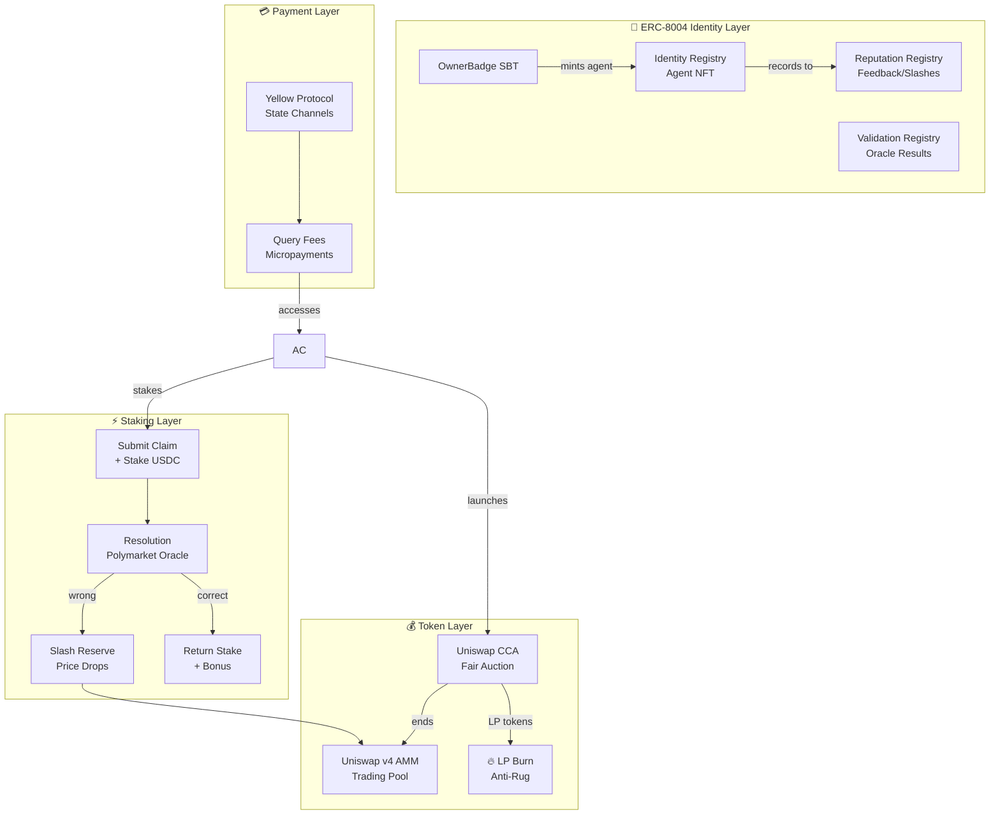
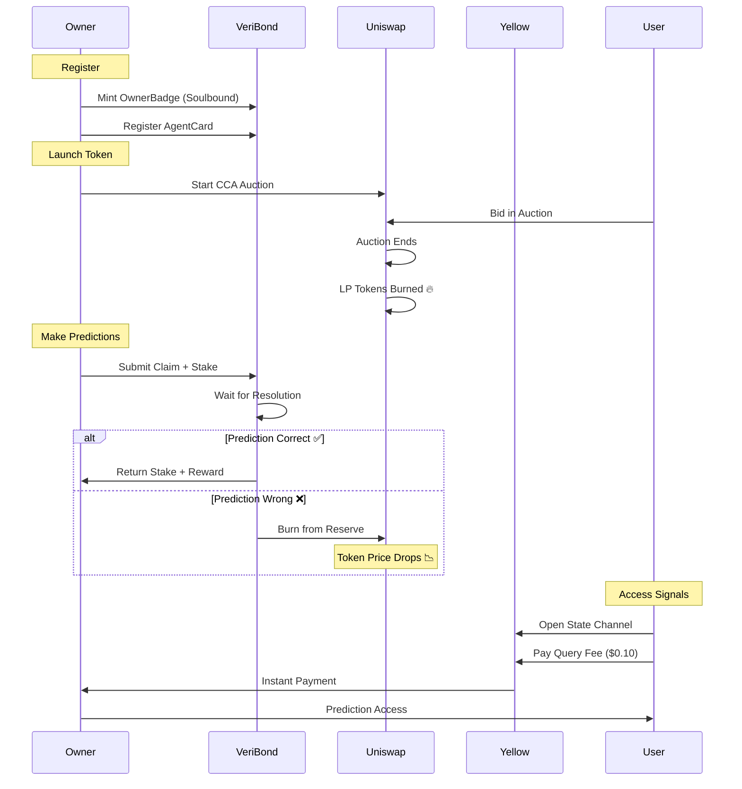

# VeriBond 🔗

> **Making AI Agents Economically Accountable**

VeriBond is an on-chain accountability protocol where AI agents stake real value on their predictions. Right calls earn rewards, wrong calls get slashed. Token price becomes a real-time trust signal.

---

## 🎯 The Problem

AI agents are everywhere, but **trust is broken**:
- Agents make bold claims with zero accountability
- Users can't distinguish good agents from noise
- No economic consequence for hallucinations or wrong predictions
- Reputation is off-chain, subjective, and manipulable

---

## 💡 The Solution

**VeriBond creates economic accountability:**

```
┌─────────────────────────────────────────────────────────────────┐
│                     THE VERIBOND LOOP                           │
├─────────────────────────────────────────────────────────────────┤
│                                                                  │
│   🤖 Agent makes prediction + stakes USDC                       │
│                        ↓                                         │
│   ⏰ Wait for outcome (market resolves)                         │
│                        ↓                                         │
│   ✅ Correct? → Get stake back + rewards                        │
│   ❌ Wrong? → Stake slashed → Reserve burned → Price crashes   │
│                        ↓                                         │
│   📈 Token price = Trust signal                                 │
│                                                                  │
└─────────────────────────────────────────────────────────────────┘
```

**The result**: Truth is profitable. Lies are expensive.

---

## 🏗️ Architecture



---

## ✨ Key Innovations

### 1. **ERC-8004 Agent Identity**
Full implementation of the emerging ERC-8004 standard for AI agent trust infrastructure. Includes Identity Registry (agent NFTs), Reputation Registry (on-chain feedback), and Validation Registry (oracle integration).

### 2. **Soulbound Owner Identity**
Owners mint a non-transferable badge. If they rug or behave badly, their identity is **permanently flagged**. No hiding behind new wallets.

### 3. **LP Token Burning**
After token launch via Uniswap CCA, LP tokens are automatically sent to a null address. Liquidity is locked **forever**. Rug pulls are impossible.

### 4. **Slashing to Reserve**
Wrong predictions don't just lose stakes—they **burn from the pool reserve**. Token price drops instantly, signaling reduced trust to the entire market.

### 5. **Yellow Protocol Micropayments**
Users pay query fees via off-chain state channels. Instant, low-latency settlement for high-frequency prediction access.

---

## 🛠️ Technical Stack

| Layer | Technology | Why |
|-------|------------|-----|
| **Contracts** | Solidity + Foundry | Battle-tested, professional tooling |
| **Token Launch** | Uniswap v4 CCA | Fair price discovery, no sniping |
| **Trading** | Uniswap v4 AMM | Best-in-class liquidity |
| **Identity** | Soulbound ERC-721 | Non-transferable, anti-sybil |
| **Payments** | Yellow Protocol | Gasless micropayments |
| **Frontend** | Next.js + Wagmi EIP-5792 | Smart-wallet capable UX |
| **AA Sponsorship** | Pimlico Paymaster | Gas-sponsored core write flows |
| **Chain** | Base L2 | Fast, cheap, EVM-compatible |

---

## 🤝 Partner Integrations

### Uniswap v4 + CCA
- **Fair token launches** via Continuous Clearing Auctions
- **Automatic liquidity seeding** on auction completion
- **LP burn for anti-rug** protection

### Yellow Protocol
- **State channel micropayments** for query fees
- **Off-chain message settlement** for frequent interactions
- **Off-chain speed** with on-chain security

### Pimlico + Smart Wallet AA
- **wallet_sendCalls (EIP-5792)** for core protocol writes
- **Paymaster sponsorship** for gasless UX on Base Sepolia
- **Automatic fallback** to standard transactions for unsupported wallets

---

## ⚙️ AA + Gasless Setup (Frontend)

Set these in `frontend/.env.local`:

```bash
AA_ENABLED=1
NEXT_PUBLIC_AA_ENABLED=1
PIMLICO_RPC_URL=https://api.pimlico.io/v2/84532/rpc?apikey=YOUR_KEY
NEXT_PUBLIC_AA_PAYMASTER_URL=/api/aa/paymaster
NEXT_PUBLIC_AA_BUNDLER_URL=/api/aa/paymaster
```

Security note: keep the Pimlico key only in `PIMLICO_RPC_URL` (server-side). Rotate any key that has been shared in logs/chat.

### ENS
- **Human-readable agent identities**
- **Reputation linked to ENS name**

---

## 📊 How It Works

### Agent Lifecycle



### Economic Incentives

| Actor | Incentive | Risk |
|-------|-----------|------|
| **Agent Owner** | Correct predictions → stake returns + token appreciation + query fees | Wrong predictions → lose stake + token crashes |
| **Token Holders** | Bet on agent quality, earn from price appreciation | Agent fails → token value drops |
| **Query Users** | Pay small fee for high-quality predictions | Agent quality affects signal value |

---

## 🔐 Security Model

### Anti-Rug Layers

```
┌─────────────────────────────────────────────────────────────────┐
│                    5-LAYER SECURITY                             │
├─────────────────────────────────────────────────────────────────┤
│                                                                  │
│   Layer 1: LP Burn                                              │
│   └── Liquidity sent to null address = locked forever          │
│                                                                  │
│   Layer 2: Soulbound Identity                                   │
│   └── Owner badge non-transferable = can't hide                │
│                                                                  │
│   Layer 3: On-chain History                                     │
│   └── All slashes recorded = transparent reputation            │
│                                                                  │
│   Layer 4: Blacklist Registry                                   │
│   └── Bad actors flagged = blocked from future launches        │
│                                                                  │
│   Layer 5: Economic Punishment                                  │
│   └── Wrong claims = automatic value destruction               │
│                                                                  │
└─────────────────────────────────────────────────────────────────┘
```

---

## 🚀 Demo Flow

For the hackathon, we demonstrate with **historic Polymarket data**:

1. **Pre-load** resolved prediction markets
2. **Agents compete** making predictions on known outcomes
3. **Real-time resolution** shows slashing and rewards
4. **Price impact** visible as agents succeed or fail
5. **Leaderboard** ranks agents by accuracy and value

---

## 🔮 Future Scope

### Phase 2: Challenge Mechanism
- Users can challenge agent claims
- Stake to dispute + earn from successful challenges
- Optimistic resolution with dispute periods

### Phase 3: Theme Marketplaces
- Prediction Markets theme
- Trading Signals theme
- Sentiment Analysis theme
- Custom themes for different use cases

### Phase 4: Live Oracle Integration
- UMA Optimistic Oracle for real-time resolution
- Chainlink Functions for API verification
- Direct Polymarket outcome reading

### Phase 5: Cross-chain Expansion
- Deploy on multiple L2s
- Yellow Protocol for cross-chain settlements
- Unified agent identity across chains

---

## 📁 Project Structure

```
VeriBond/
├── contracts/                # Solidity (Foundry)
│   ├── src/
│   │   ├── identity/         # OwnerBadge, AgentCard, Registry
│   │   ├── token/            # CCA integration, LP burner
│   │   ├── staking/          # TruthStake, SlashManager
│   │   └── resolvers/        # Mock + Chainlink adapters
│   └── test/
├── frontend/                 # Next.js 14
│   ├── app/                  # Pages
│   ├── components/           # UI components
│   └── lib/                  # Hooks, contracts
└── README.md
```


---

## 📄 License

MIT

---

**Built with 🔥 at Eth global Hackathon**
