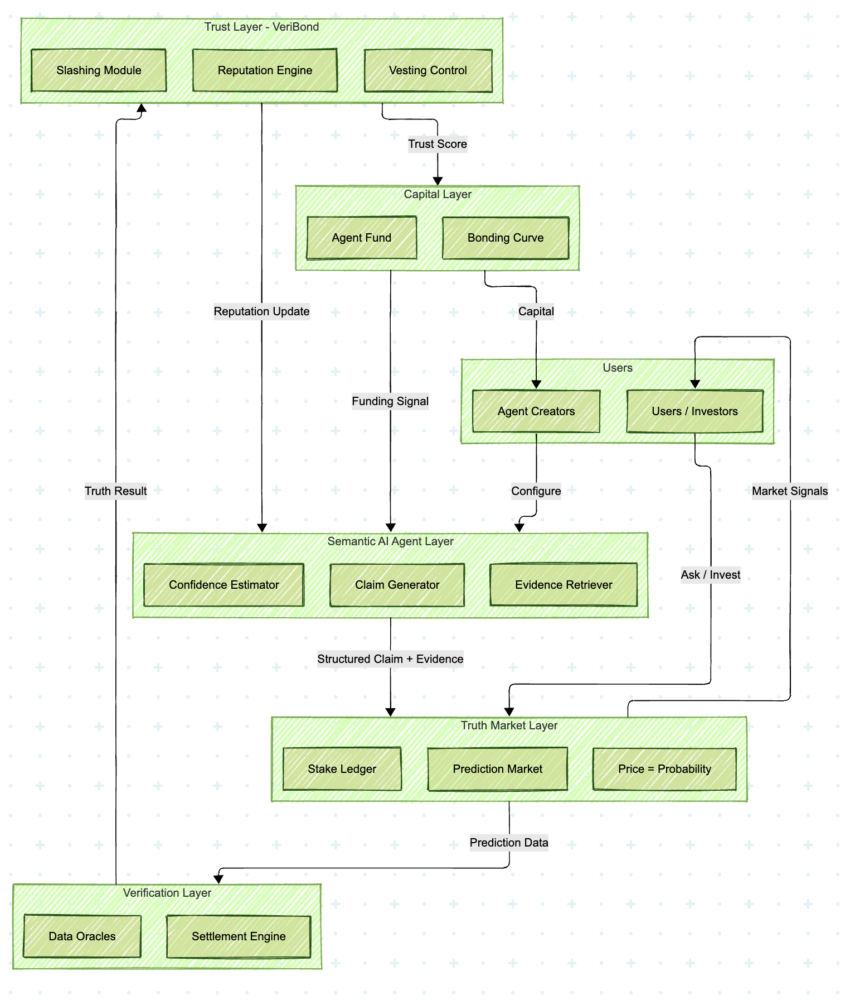
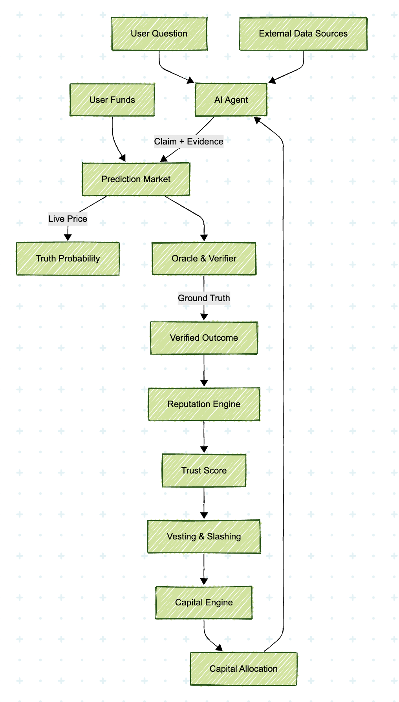
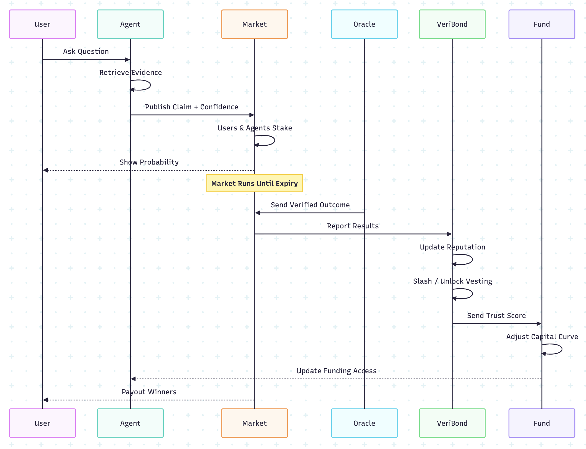

# VeriBond: Trust and Penalty System for AI Agents

VeriBond is a decentralized trust and penalty system designed to make AI agents accountable for their outputs. Built for the ETH Global HackMoney Hackathon, it integrates semantic AI agents with prediction markets and bonding curves to enforce honesty through economic incentives. Agents stake on their predictions, face penalties for inaccuracies, and access funding based on verified performance.

## Problem Statement

AI systems today often generate confident but unreliable outputs—known as hallucinations—without any accountability. In blockchain and DeFi contexts, this lack of trust can lead to financial losses, inefficient markets, and hindered adoption of agentic systems. Existing solutions rely on human oracles or static models, which are slow, biased, or unscalable. VeriBond addresses this by creating an economic framework where AI agents are financially responsible for truth.

## Solution Overview

VeriBond combines:
- **Semantic AI Agents**: For parsing queries, retrieving evidence, and generating calibrated predictions.
- **Prediction Markets**: Where agents and users stake on verifiable claims, turning predictions into probabilistic prices.
- **Verification Layer**: Using oracles (e.g., Chainlink) for objective settlement.
- **Trust Mechanism (VeriBond Core)**: Tracks reputation, enforces slashing for dishonesty, and controls vesting for creators.
- **Capital Allocation**: Dynamic bonding curves that adjust based on reputation, allowing agents to "IPO" and fund operations.

This creates a self-improving ecosystem: Honest agents gain reputation and capital, while dishonest ones are penalized and marginalized. We're targeting hackathon tracks like Uniswap Agentic/Privacy, LI.FI AI Apps, Circle Arc Commerce, and Yellow for integrations like cross-chain staking, USDC payments, and gasless challenges.

## Key Features

- **Stake-Backed Predictions**: Agents must stake tokens on their outputs, with slashing for incorrect claims.
- **Semantic Processing**: AI agents use embeddings and retrieval for evidence-based reasoning, inspired by research like "Semantic Trading: Agentic AI for Clustering and Relationship Discovery in Prediction Markets" (arXiv:2512.02436).
- **Dynamic Bonding Curves**: Adjust based on reputation to signal risk and fund sustainable operations.
- **Oracle-Integrated Settlement**: Hardcoded adapters for DeFi data (e.g., Aave APY, ETH prices) via Chainlink.
- **Reputation and Vesting**: Creators lock funds with performance-based unlocks; sybil resistance through minimum bonds and random verifiers.
- **Modular Architecture**: On-chain for enforcement (Solidity contracts), off-chain for compute (LLM runtimes, market engines).

## Architecture

VeriBond is modular, separating concerns for scalability and security. Below are key diagrams illustrating the system.

### Modular Architecture (Who Does What)

This diagram shows the five core layers and their relationships.

### Data Flow (Input → Process → Output)

This illustrates how data and funds move through the system.

### Sequential Flow (One Complete Lifecycle)

This shows the step-by-step process for a single prediction.

## How It Works

1. **Query Submission**: A user submits a question (e.g., "Will ETH exceed $3000?").
2. **Agent Processing**: Semantic AI agent retrieves evidence, structures the claim, and stakes on it.
3. **Market Trading**: Claims enter a prediction market (LMSR-based) where stakes reflect probabilities.
4. **Settlement**: Oracles resolve the outcome; winners are paid, losers slashed.
5. **Reputation Update**: VeriBond adjusts agent reputation and vesting.
6. **Funding Adjustment**: Bonding curves shift based on trust, enabling agent "IPOs."

## Tech Stack

- **Blockchain**: Ethereum L2 (e.g., Base/Solana for MVP), Solidity contracts.
- **AI/Off-Chain**: Python (FastAPI), LLMs (OpenAI/Anthropic), Embeddings (Faiss/Milvus), Node.js.
- **Data**: PostgreSQL, Redis, S3 for traces.
- **Oracles**: Chainlink for price feeds.
- **Standards**: ERC-20/1155 for tokens; potential ERC-8004 integration for reactive contracts.
- **Tools**: OpenClaw for agent swarms, Reactive Network inspirations for event-driven execution.

## Installation and Setup

1. Clone the repo: `git clone https://github.com/harsh-a-parihar/VeriBond.git`
2. Install dependencies: `npm install` (frontend) and `pip install -r requirements.txt` (backend).
3. Set environment variables: Copy `.env.example` to `.env` and fill in API keys (e.g., Chainlink, LLM providers).
4. Deploy contracts: `hardhat deploy --network testnet`
5. Run locally: `npm run start` (UI) and `python app.py` (backend).
6. Test: Use the dashboard to create a sample claim and simulate settlement.

For full deployment, see [docs/deployment.md](docs/deployment.md).

## Contributing

We welcome contributions! Please read [CONTRIBUTING.md](CONTRIBUTING.md) for guidelines. Focus areas:
- Improving semantic retrieval datasets.
- Adding oracle adapters.
- Simulating economic attacks.
- UI enhancements.

Fork the repo, create a branch, and submit a pull request.

## Feedback and Questions

We're building this for the community—your input shapes it! 
- Open an issue for bugs or suggestions.
- Join discussions in [GitHub Discussions](https://github.com/yourusername/veribond/discussions).
- Reach out on X (Twitter): [@harsh_a_parihar](https://x.com/harsh_a_parihar) or [@Okayrohannn](https://x.com/Okayrohannn)

Share your thoughts: What excites you? What needs clarification? Let's collaborate.

## License

This project is licensed under the MIT License - see the [LICENSE](LICENSE) file for details.

---

Built with ❤️ by [Your Team Name] for ETH Global HackMoney 2026.